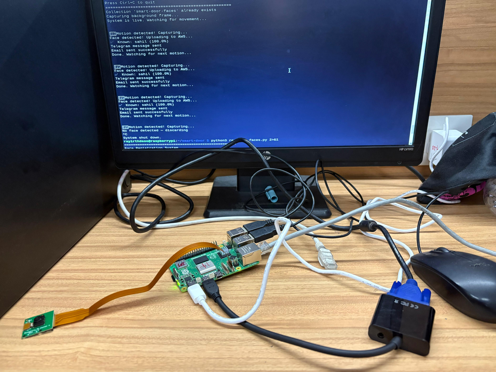
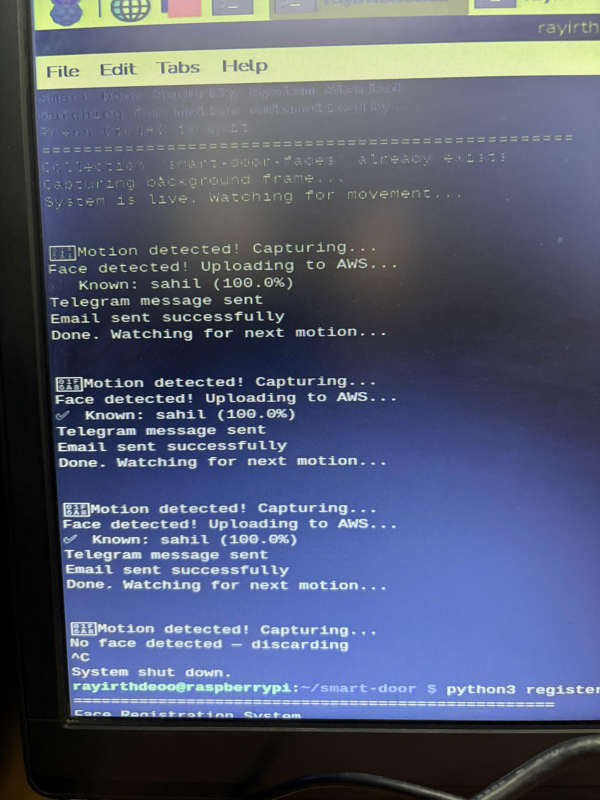
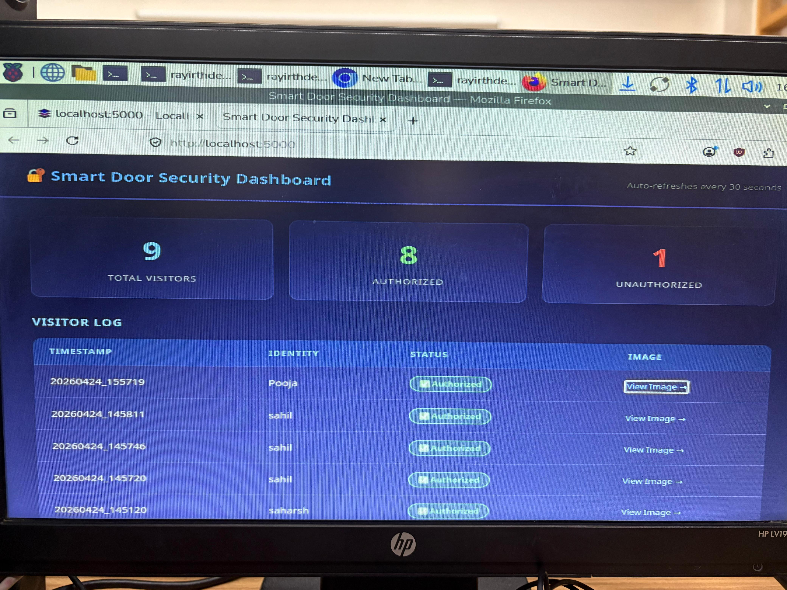
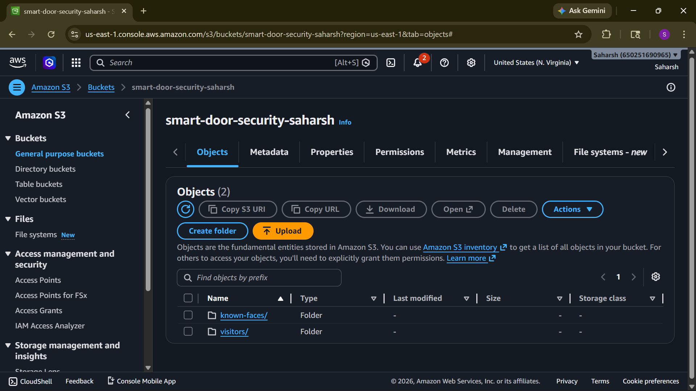

# Smart Door Security System with Face Recognition

> An IoT-based smart security system using Raspberry Pi 5, AWS Cloud AI, OpenCV, and real-time alerts.

**Authors:** Saharsh Saraf & Sahil Lahane | **Mentor:** Dr. Pooja Gundewar | MIT World Peace University, Pune

---

## Overview

A fully functional hybrid edge-cloud IoT security system that:
- Detects motion automatically using OpenCV background subtraction
- Captures visitor images using Raspberry Pi Camera Module
- Identifies known vs unknown faces using AWS Rekognition (deep learning)
- Sends real-time Telegram alerts with photo to owner's phone
- Logs every event to AWS DynamoDB
- Displays live visitor analytics on a Flask web dashboard

---

## Project Photos

### Hardware Setup

### System Running

### Live Dashboard

### AWS S3 Cloud Storage

---

## System Architecture